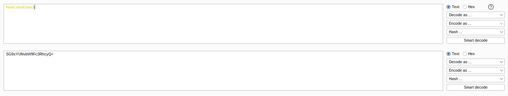
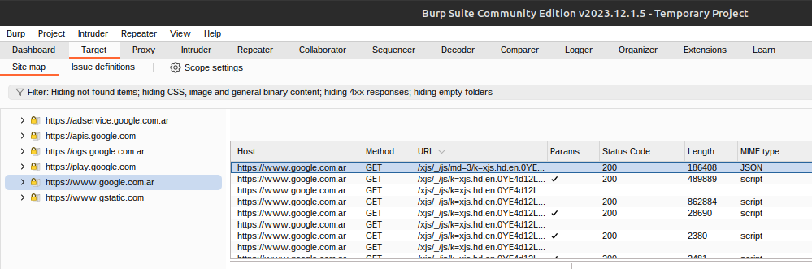
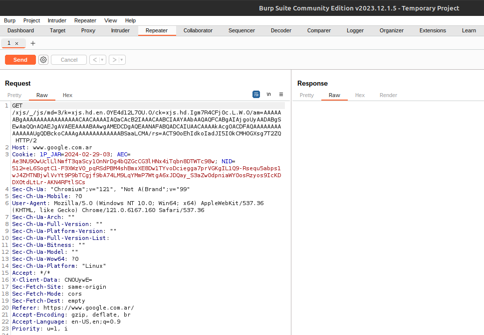

# Burp Suite

Burp Suite is a set of tools for web application security testing.

First and foremost, use the button `open browser` to open a browser that is configured to use Burp Suite as a proxy.

## Decoder

Decoder is a tool that can be used to decode/encode data. It is a very useful tool for web application security testing.

In this example we encoded a string into base64.

## Repeater

Repeater is a tool that can be used to repeat requests. Specially usefull when want to do crafted payloads.

While you are here, you can click on a request then CTRL+R to send it to the repeater. or second click on the request and select `Send to Repeater`.

And here we can modify the request and send it again.