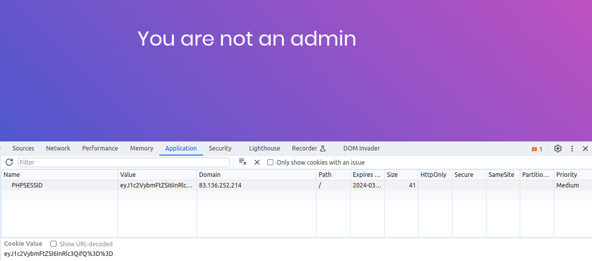
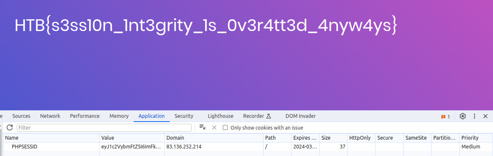

# Cookies

Cookies are small pieces of data that are stored in the user's browser. They are used to store information about the user's session, such as their preferences, login status, and shopping cart contents.

## Example

```web
PHPSESSID=eyJ1c2VybmFtZSI6InRlc3QifQ%3D%3D
```

The `%3D` is the URL encoded version of `=`.

Here we have a cookie that stores a value in base64, if we decode it we get:

```web
{"username":"test"}
```



Here we can see that the username is test.

Which was the username I created in the application. Now if we want to instead use the username admin and encoded back to base64 we get:

```web
PHPSESSID=eyJ1c2VybmFtZSI6ImFkbWluIn0=
```



Now we can see that the username is admin. This example is from a challenge called `baby auth` from `HTB`

- https://app.hackthebox.com/challenges/179