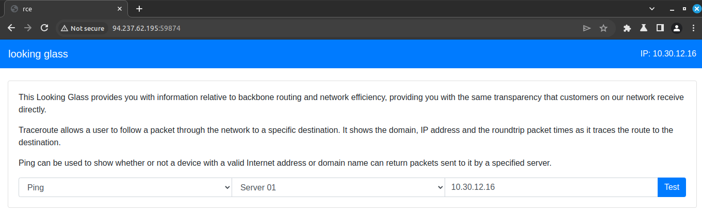
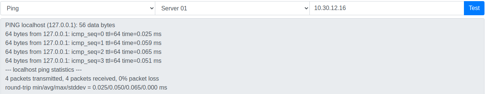
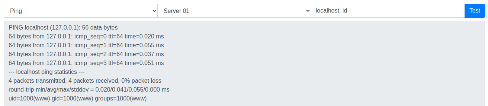

## Remote Code Execution

What is RCE?

Remote Code Execution (RCE) is a type of vulnerability that allows an attacker to execute arbitrary code on a target server or application. This can be used to gain access to the server, steal data, or perform other malicious activities.

### HTB Challenge

https://app.hackthebox.com/challenges/177

### Resolution

The challenge looks like this

We have 2 select boxes and one input, so our attention goes to the input, we can try to inject some code to see if we can get a response from the server.

First we try to do the write box part to see how the server responds.

Now since this is running bash, we can try to add a `;` at the end of the `localhost` and execute another command.

We got confirmation that we are executing commands, now instead of `id` i'm going to find the flag with this command `localhost; ls / | grep -i "flag"`

At this point we should find a file called `flag_xxx`

Now we can do `localhost; cat <name>` to see the content of the file.